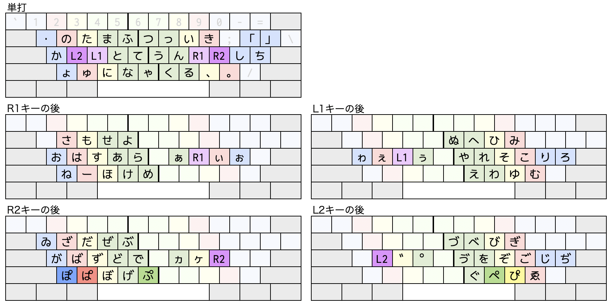
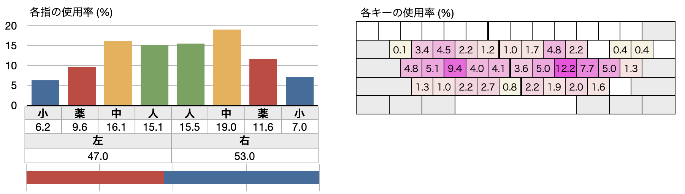
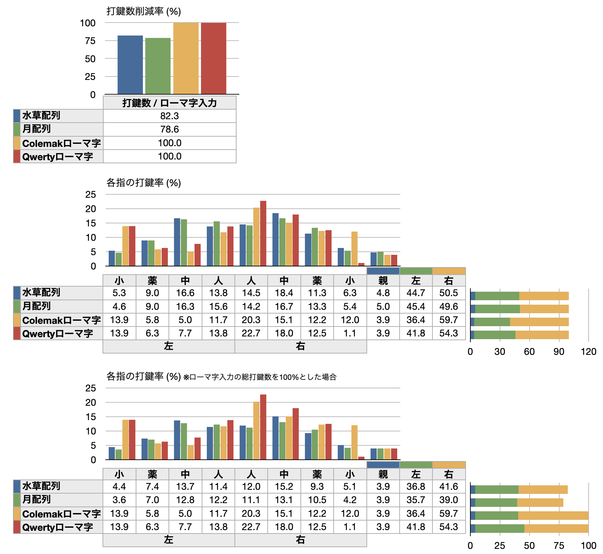
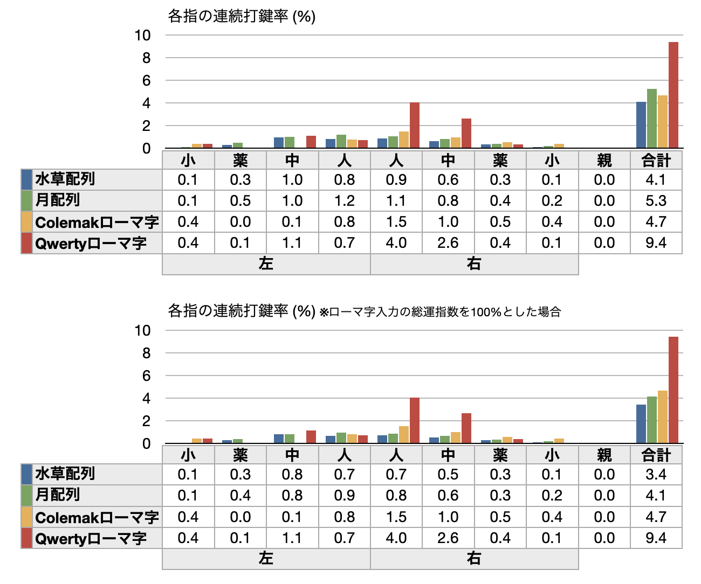
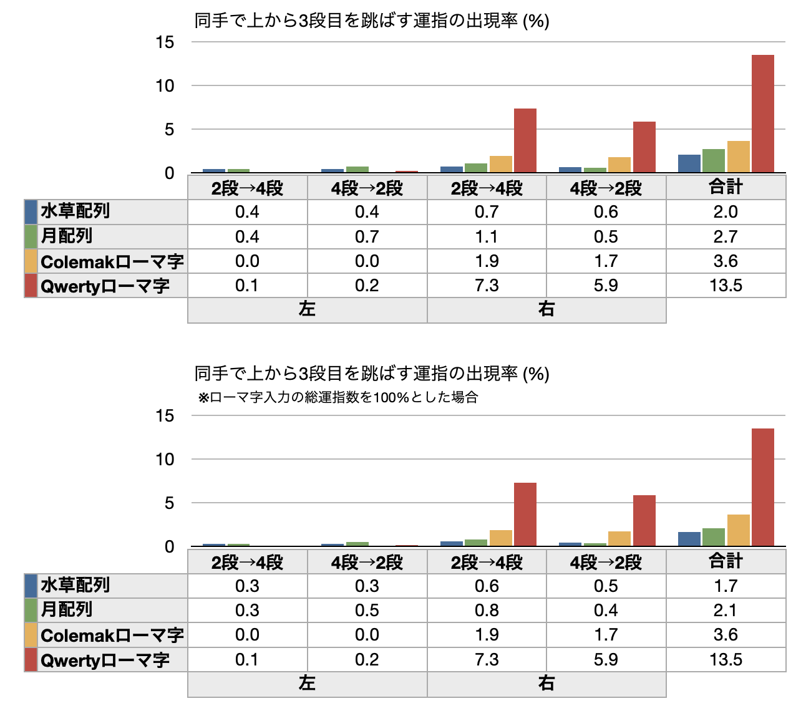
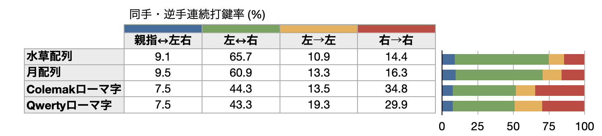
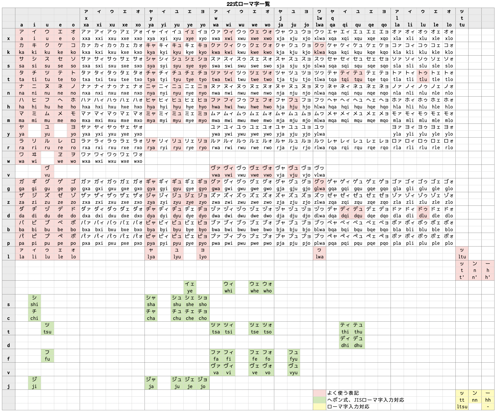

# 小指の移動量が少ない日本語かな入力配列 「水草配列」

水草配列 (みずくさはいれつ) は素材集めからデータ解析、配列作りまで1人で行い、実際に使用しながら調整した日本語入力配列です。  
10年以上実際に使い続けています。

## 特徴

- 小指が担当するキーを極力減らしています。使用するキーの数が少ないため、入力モード切り換えや文字種変換、キーボードショートカットなしで多くの記号が入力できます。
- ローマ字定義のカスタマイズのみで実装できます ([Mozc](https://github.com/google/mozc) と[かわせみ](https://www.monokakido.jp/ja/mac/kawasemi3/)で確認済み。MS-IME でも実装できますが、レジストリを操作する必要があります)。
- 英数入力に Colemak 配列を使用することを想定しています (Qwerty 配列でも使えます)。

## 入力方法

中指と薬指のホームポジションのキーを前置シフトとして使用します。

## データ的なもの

よくあるやつ。数字や記号の入力数は省いています

## 他の配列との比較

比較対象は Qwerty ローマ字、Colemak ローマ字、そして中指シフト配列として評価の高い月配列。  
ローマ字は日本式を想定していますが、ヘボン式の方が入力しやすい文字 (ji、sha など) はそちらを優先しました。「ん」は基本 [n] で、状況に応じて [n] [n] を使用するとしました。  
実際の使用環境に近づけるため、句読点や括弧の後にスペースキーでかな漢字変換 (変換効率100%、つまり一発で確定) を行うことを想定しています。  
[前項](#データ的なもの)と結果が異なるデータがありますが、これは使用したサンプルが違うためです。

## 資料

配列作りに使用した資料の CSV ファイルです。ネット上のいろいろなジャンルの文章を適当に集めて集計しました。  
俺様配列を作りたい方のお役に少しは立てるかもしれません。

| 内容 | 説明 |
|------|------|
| [1文字単位の出現数](./data/list_1mozi.csv) | 純粋に各文字の出現数をカウント |
| [1音単位の出現数](./data/list_1on.csv) | 「きゃ」などを1音としてカウント |
| [連続した2文字の出現数](./data/list_2mozi_renzoku.csv) | 連続した文字の出現パターンをカウント |
| [連続した2音の出現数](./data/list_2on_renzoku.csv) | 「きゃあ」などの出現数をカウント |
| [1文字挟んだ2文字の出現数](./data/list_2mozi_1tutobasi.csv) | 「あいう」と「あえう」など、1文字目と3文字目が同じものを同一としてその出現数をカウント |
| [2文字連続を表にしたもの](./data/table_2mozi_renzoku.csv) | 縦軸が1文字目、横軸が2文字目 |

## ローマ字ルール定義ファイル

ファイルの使用方法については各自で調べていただきたいと思います。不親切で申しわけございません。

### MS-IME 用レジストリファイルについて

誤った情報が登録されるとシステムが起動しなくなったり、アプリケーションが削除できなくなったりすることもあります。  
使用される場合は正しい知識を持って細心の注意を払っていただくようお願いいたします。  

- Windows10 Pro 21H2 で動作確認を行っています。異なる環境では正しく登録できない可能性があります。
- 登録実行前にバックアップを取ることをおすすめします。
- 問題が生じた場合はまず「IME を規定の設定に戻す」を実行してみてください。
- 「以前のバージョンの Microsoft IME」 を使用してください。

### ファイル一覧

|                   | Mozc | かわせみ | MS-IME [※使用注意](#ms-ime-用レジストリファイルについて) |
|-------------------|------|----------|--------|
| **Colemak配列**   | [テーブル設定ファイル](./data/Mozc_Mizukusa_Colemak.txt) | [ルールファイル](./data/Kawasemi_Mizukusa_Colemak.nrset) | [レジストリファイル](./data/MS-IME15_Mizukusa_Colemak.reg) |
| **QwertyUS配列**  | [テーブル設定ファイル](./data/Mozc_Mizukusa_QwertyUS.txt) | [ルールファイル](./data/Kawasemi_Mizukusa_QwertyUS.nrset) | [レジストリファイル](./data/MS-IME15_Mizukusa_QwertyUS.reg) |
| **QwertyJIS配列** | [テーブル設定ファイル](./data/Mozc_Mizukusa_QwertyJIS.txt) | [ルールファイル](./data/Kawasemi_Mizukusa_QwertyJIS.nrset) | [レジストリファイル](./data/MS-IME15_Mizukusa_QwertyJIS.reg) |

各ファイルの使用は自己責任にてお願いいたします。  
ファイルを使用することで生じた不具合・損害等について omonomo は責任を負いません。  

## [おまけ] 新ローマ字表記

配列を考える過程で、ローマ字入力も検討していた時に作ったものです。あくまでも思いつきなので、実際に使ってみると不具合があるかもしれません。ヘボン式と共存できるようにしたつもりです。  
ポイントは、発音できるか否かにかかわらず50音の表にあわせて機械的にアルファベットを当てはめているところです。  
2022年はすでに過ぎていますが、22式ローマ字 (にーにーしきろーまじ) と名付けておきます。

### ルール

- 「っ」は t 単独、「ん」は n 単独、「ー(長音)」は h 単独で表します (例: カッキーン → katkihn)。ただし読みが変わる場合 (例: おーい → ohi → おひ) はアポストロフィーを入れます (oh'i)。
- キーボードで入力する際、「っ」は [t] [t] 、「ん」は [n] [n] 、「ー(長音)」は [h] [h] か [-(ハイフン)] が使えるものとします。
- その他のルールについては現行の方式に従うものとします。

## リンク

- [全角英数や半角カナが判別しやすい、文字間隔調整機能付き等幅フォント「Cyroit」](https://omonomo.github.io/Cyroit/): 合成フォントを作ってみました。
- [DefaultKeyBinding.dict サンプル](https://omonomo.github.io/DefaultKeyBinding/): タイトル通りです。