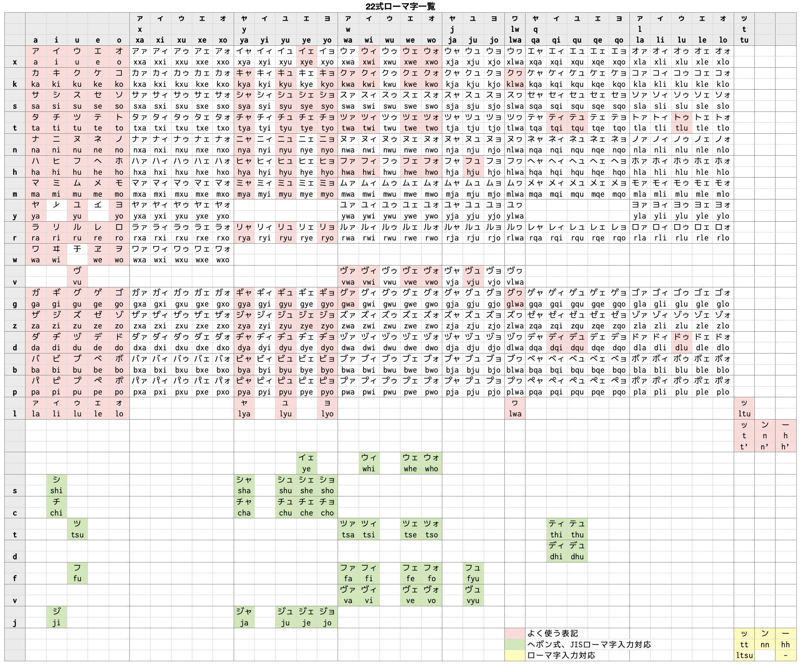

## 指の移動量が少ない日本語かな入力配列 「水草配列」
素材集めからデータ解析、配列作りまで1人で行い、実際に使用しながら調整した日本語入力配列です。  
10年以上実際に使い続けている実績があります。

## 特徴
- 打鍵数を減らすことよりも指の移動量を少なくすることを目的にしています。使用するキーの数が少ないため、入力モード切り換えや文字種変換なしで多くの記号が入力できます。
- ローマ字カスタマイズのみで実装できます (Mozcとかわせみは確認済み。MS-IMEは実装できますが、レジストリをいじる必要があります)。
- 英数入力にColemak配列を使用することを想定しています (Qwerty配列でも使えます)。

## 入力方法
中指と薬指のホームポジションのキーを前置シフトとして使用します。

## データ的なもの
よくあるやつ。

 

## 他の配列との比較
比較対象はQwertyローマ字、Colemakローマ字、そして中指シフト配列として評価の高い月配列。  
ローマ字は日本式を想定していますが、ヘボン式の方が入力しやすい文字はヘボン式を優先しました。「ん」は基本[n]で、状況に応じて[n][n]を使用するとしました。  
実際の使用環境に近づけるため、句読点や括弧の後にスペースキーでかな漢字変換 (変換効率100%、つまり一発で確定) を行うことを想定しています。

## 資料
配列作りに使用した資料のCSVファイルです。俺様配列を作りたい方のお役に少しは立てるかもしれません。

| 内容 | 説明 |
|---|---|
| [1文字単位の出現数](./data/list_1mozi.csv) | 純粋に各文字の出現数をカウント |
| [1音単位の出現数](./data/list_1on.csv) | 「きゃ」などを1音としてカウント |
| [連続した2文字の出現数](./data/list_2mozi_renzoku.csv) | 連続した文字の出現パターンをカウント |
| [連続した2音の出現数](./data/list_2on_renzoku.csv) | 「きゃあ」などの出現数をカウント |
| [1文字挟んだ2文字の出現数](./data/list_2mozi_1tutobasi.csv) | 「あいう」と「あえう」など、1文字目と3文字目が同じものをまとめて出現数をカウント |
| [2文字連続を表にしたもの](./data/table_2mozi_renzoku.csv) | 縦軸が1文字目、横軸が2文字目 |

## 定義ファイル
ローマ字定義ファイルです。タブ区切りになっています。不親切で申しございません。

- [Colemak配列用](./data/MizukusaForColemak.txt)
- [QwertyJIS配列用](./data/MizukusaForQwertyJIS.txt)
- [QwertyUS配列用](./data/MizukusaForQwertyUS.txt)

## [おまけ] 新ローマ字表記
配列を考える過程で、ローマ字入力も検討していた時に作ったものです。あくまでも思いつきなので、使ってみると不具合があるかもしれません。ヘボン式と共存できるようにしたつもりです。  
ポイントは、発音できるか否かにかかわらず50音の表にあわせて機械的にアルファベットを当てはめているところです。  
2022年はすでに過ぎていますが、22式ローマ字と名付けておきます。

### ルール
- 「っ」はt単独、「ん」はn単独、「ー」はh単独で表します。ただし読みが変わる場合 (例: おーい→ohi→おひ) はアポストロフィーを入れます (oh'i)。
- キーボードで入力する際、「っ」は[t][t]、「ん」は[n][n]、「ー」は[h][h]か[-]が使えるものとします。
- その他のルールについては現行の方式に従うものとします。

